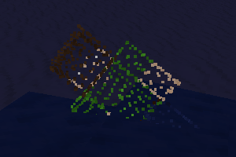

# Ghosts

Adds purely (audio-)visual ghosts of players you have killed that will haunt you at midnight.

## About

Supports arbitrary player models and textures with a few limitations. Easter eggs included!

Depends on [`modlib`](https://github.com/appgurueu/modlib) and [`moblib`](https://github.com/appgurueu/moblib).

All code written by [Lars Müller](https://github.com/appgurueu) and licensed under the MIT license.

Media (sound files) use different licenses, of which the most restrictive is [**CC BY 3.0**](https://creativecommons.org/licenses/by/3.0/):

* [Ghost (`ghosts_ghost.1.ogg`)](https://freesound.org/people/yunusakademi/sounds/515865/) - **CC0**
* [Horror ghost (`ghosts_ghost.2.ogg`)](https://freesound.org/people/HaraldDeLuca/sounds/380510/) - **CC0**
* [Horror ghost and whoosh (`ghosts_ghost.3.ogg`)](https://freesound.org/people/klankbeeld/sounds/169979/) - **CC BY 3.0**

## Screenshot



## Links

* [GitHub](https://github.com/appgurueu/ghosts) - sources, issue tracking, contributing
* [ContentDB](https://content.minetest.net/packages/LMD/ghosts/) - releases (cloning from GitHub is recommended)
* [Minetest Forum](https://forum.minetest.net/viewtopic.php?f=9&t=27305) - (more organized) discussion
* [Discord](https://discord.gg/ysP74by) - discussion, chatting

## Limitations

There are three mechanisms to display things in Minetest:

* Entities, significant overhead per entity, disallowed per the inspirational challenge
* Nodes, fast but fairly limited (only one node per position)
* HUD
* Particles

Projecting everything onto the HUD would mean more work for the server and would look pretty bad with lag; besides, this isn't needed here, so particles are used.

Overally, Minetest imposes the following limitations:

* Each particle gets it's own packet. Some packets might be delayed, resulting in a partially "separated" ghost.
* Particle performance is rather poor, as each particle also gets it's own drawcall. This might affect client performance.
* Texture pack provided skins must ideally have the same dimensions as the mod textures (or at the very least, a multiple of it) because the "sheet" modifier, which requires image dimensions, is used.
* As multithreading isn't possible currently, ghosts have to be spawned rather *fast* as to not block the server step.
* [This fills up your memory.](https://github.com/minetest/minetest/issues/11531)

Other limitations are specific to the implementation:

* Only the B3D file format for models (ghosts using a different model file format won't appear) and PNG for images (otherwise, it resizes the texture to fallback dimensions, leading to even more client lag) are supported
* If image dimensions can't be determined easily (non-PNG image or complex texture modifier), it will fall back to resizing the ghost texture to the specified fallback resolution, further hurting client performance due to [cached parts not being taken advantage of](https://github.com/minetest/minetest/issues/11587).

### Server-side texture packs

Server-side texture packs aren't supported, as there's no proper API for getting their paths yet. You can however use a "texture pack mod" to override textures (and other media) - all you have to do is add all mods as (optional) dependencies of that mod, ensuring it loads last. You may want to have your mod rewrite it's `mod.conf` to achieve that:

```lua
local current_mod_name = minetest.get_current_modname()
local mod_conf = Settings(minetest.get_modpath(current_mod_name))
local mod_names = minetest.get_modnames()
for index, mod_name in pairs(mod_names) do
	if mod_name == current_mod_name then
		-- Remove the mod itself so we don't get a circular dependency
		table.remove(mod_names, index)
		break
	end
end
local depends = table.concat(modnames, ", ")
if mod_conf:get"optional_depends" ~= depends then
	mod_conf:set("optional_depends", depends)
	mod_conf:write()
	minetest.request_shutdown"Server-side resource pack mod: Updated dependencies, please restart"
end
```

## Configuration

<!--modlib:conf:2-->
### `chance_reduction_per_night`

Decrease in chance of ghost spawning per night

* Type: number
* Default: `0.5`

### `fallback_resolution`

#### `1`

Fallback resolution width

* Type: number
* Default: `64`

#### `2`

Fallback resolution height

* Type: number
* Default: `64`


### `force_fallback_resolution`

Whether to always resize textures to the given fallback dimensions. Guarantees support for arbitrary resolution texture packs. If this is not set, texture packs with a resolution lower than the server texture resolution won't work at all; texture packs with a multiple of said resolution will work well, however. A resolution of 64x64 or lower is usually acceptable performance-wise.

* Type: boolean
* Default: `false`

### `forget_duration_nights`

How many nights it takes for a ghost to forget their victim

* Type: number
* Default: `10`

### `particles_per_metre`

Particles per one metre (= node size)

* Type: number
* Default: `10`

### `spawn_chance`

Chance of a ghost spawning the first night

* Type: number
* Default: `1`
<!--modlib:conf-->

## API

### `ghosts.spawn_ghost(params)`

Spawns a ghost. Returns success: `nil` if spawning the ghost failed, `true` if it succeeded. `params` is a table with the following mandatory fields:

* `expiration_time`: In seconds. Time it takes for the ghost to disappear.
* `pos`: Minetest vector: Ghost spawn position
* `velocity`: Minetest vector.
* `implode`: Number, how much the ghost particles go towards their center during expiration time. Value of `1` will collapse the ghost to a point, `-10` will explode it to 10x it's size.
* `model`: String. B3D model filename. Example: `"character.b3d"`.
* `textures`: List (table) of model textures (strings). Example: `{"character.png"}`.

Optional fields:

* `playername`: String. Ghost will be visible (and audible) to all players if not given.
* `sound`: No ghost sound is played if `sound` is falsey.
* `disperse`: Number. How fast the ghost should disperse. Default is `0`.

### `victim_player:set_hp(hp, reason)`

If `reason.object` is set to a player (the "`killer_player`") and `victim_player` dies, `killer_player` will be haunted by `victim_player`. If you use `victim_player:punch`, this is already the case.